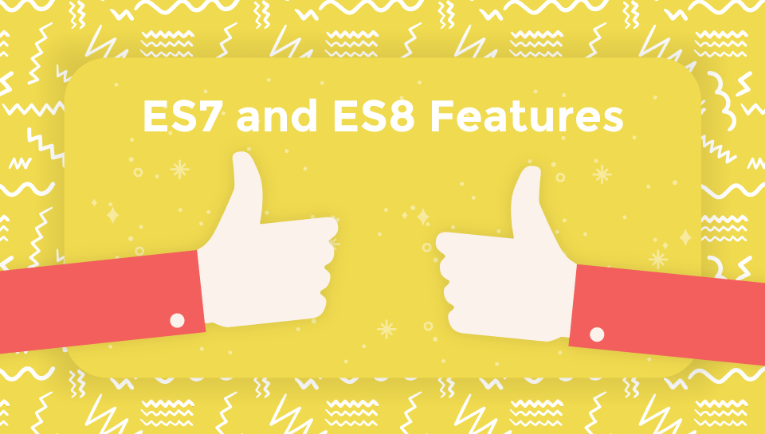

footer: © NodeProgram.com, Node.University and Azat Mardan 2017
slidenumbers: true

---

# ES7 and ES8 Features
## Intro

Azat Mardan @azat_co

---

### Recently I wrote a blog [post](https://webapplog.com/es6) and even created an [online course](https://node.university/p/es6) on ES6/ES2015.

---

### Guess what? TC39—the mighty overseer of JavaScript—is moving forward with ES8 so let's cover ES7 and ES8 (or ES2016 and ES2017 officially).

---

### Luckily, they are much, much, much smaller than the beast of a standard that was ES6. Really! ES7 has only two (2) features!

---

ES7 features:

1. `Array.prototype.includes`
1. Exponentiation Operator

---

### ES8 is not finalized yet as of this recording (Feb, 2017) but we can assume all finished proposals (stage 4) will be there... and some of the stage 3

---

### More on ECMAScript stages [in TC39 process doc](https://tc39.github.io/process-document) and in my [ES6/ES2015 course](https://node.university/p/es6)).

---

The finished 2017 (ES8) proposals are:

1. `Object.values`/`Object.entries`
1. String padding
1. `Object.getOwnPropertyDescriptors`
1. Trailing commas in function parameter lists and calls
1. Async Functions

---

### I won't include stage 3 proposals in this post, but you can check the status of proposals from stage 1 to 3 [here](https://github.com/tc39/proposals/blob/master/README.md).

---

# Slides and Other Materials

Slides: <https://github.com/azat-co/es7-es8>

Course: <https://node.university/p/es7-es8>

Post: <https://node.university/blog/498412/es7-es8>

---

# Let's go! 🚀