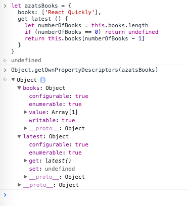

footer: © NodeProgram.com, Node.University and Azat Mardan 2017
slidenumbers: true

# ES7 and ES8 Features
## 3: ES8/ES2017 Features


Azat Mardan @azat_co


---

## `Object.values`/`Object.entries`

---

### `Object.values` and `Object.entries` are in ES8/ECMAScript2017 spec and, similarly to `Object.keys`, return arrays. The ordering of these arrays matches `Object.keys` ordering.

---

### Each items of arrays returned by `Object.keys`, `Object.values` and `Object.entries` , correspondingly contain the key, value, or entry for that particular object property/attribute.

---

Before ES8/ES2017, JavaScript developers who needed to iterate over own properties of an object had to use `Object.keys`, iterate over an array returned by it and use `obj[key]` to access each value:

```js
let obj = {a: 1, b: 2, c: 3}
Object.keys(obj).forEach((key, index)=>{
  console.log(key, obj[key])
})
```

---

Or slightly better with ES6/ES2015 `for/of`:

```js
let obj = {a: 1, b: 2, c: 3}
for (let key of Object.keys(obj)) {
  console.log(key, obj[key])
}
```

---

### You can also use good old `for/in` (ES5), but that will iterate over all enumerable properties (like the one in prototype or with names - see [MDN](https://developer.mozilla.org/en-US/docs/Web/JavaScript/Reference/Statements/for...of#Difference_between_for...of_and_for...in)), not just own properties, which may accidentally spoil the result with unexpected values like `prototype` or `toString`.

---

`Object.values` returns an array of object's own enumerable property **values**. We can iterate over it using good `Array.prototype.forEach`, but with ES6 arrow function and implicit return:

```js
let obj = {a: 1, b: 2, c: 3}
Object.values(obj).forEach(value=>console.log(value)) // 1, 2, 3
```

---

or with `for/of`:

```js
let obj = {a: 1, b: 2, c: 3}
for (let value of Object.values(obj)) {
  console.log(value)
}
// 1, 2, 3
```

---

`Object.entries`, on the other hand, will return an array of object's own enumerable property **key-value pairs** (as an array). Each item of the resulting array will be an array too.

```js
let obj = {a: 1, b: 2, c: 3}
JSON.stringify(Object.entries(obj))
"[["a",1],["b",2],["c",3]]"
```

---

We can use ES6/ES2015 destructuring (check out this [post](https://webapplog.com/es6) or this [course](https://node.university/p/es6) on in depth ES6 stuff) to declare `key` and `value` from a nested array:

```js
let obj = {a: 1, b: 2, c: 3}
Object.entries(obj).forEach(([key, value]) => {
 console.log(`${key} is ${value}`)
})
// a is 1, b is 2, c is 3
```

---

As you can guess, we can also use ES6 `for/of` (it's for arrays after all!) to iterate over the result of `Object.entries`:

```js
let obj = {a: 1, b: 2, c: 3}
for (let [key, value] of Object.entries(obj)) {
  console.log(`${key} is ${value}`)
}
// a is 1, b is 2, c is 3
```

---

### Extracting values and key-value pairs from objects are now even easier!


`Object.values` and `Object.entries` do that in a way not unlike to `Object.keys` (own properties only + order is the same). Together with `for/of` (ES6), we can not only extract but iterate over them.

---

## String padding with `padStart` and `padEnd`

---

### `String.prototype.padStart` and `String.prototype.padEnd` make working with strings in JavaScript a more pleasant experience and help avoid depending on extra [libraries](http://www.haneycodes.net/npm-left-pad-have-we-forgotten-how-to-program).

---

### `padStart(targetLength, pad)` returns a string of a given length (targetLength) by inserting pads **at the beginning**.


---

### `padStart(targetLength, pad)`

Pads are a given string, repeated if needed until the desired length is reached. Left is the beginning of a string (at least in most Western languages).

---

A typical example is creating columns with an empty space:

```js
console.log('react'.padStart(10).length)         // "       react" is 10
console.log('backbone'.padStart(10).length)         // "  backbone" is 10
```

---

It can be a useful methods for financial statements:

```js
console.log('0.00'.padStart(20))         	
console.log('10,000.00'.padStart(20))    
console.log('250,000.00'.padStart(20))    
```

---

The results will be nicely formatted as in an accounting ledger:

```
                0.00
           10,000.00
          250,000.00
```

---

Let's put some padding other than an empty space with the second argument, a string to pad with:

```js
console.log('react'.padStart(10, '_'))         // "_____react"
console.log('backbone'.padStart(10, '*'))         // "**backbone"
```

---

As you can guess from the name `padEnd` will pad a string from the end which is the right side. As for the second argument, you can actually use a string of any length. For example:

```js
console.log('react'.padEnd(10, ':-)'))         // "react:-):-" is 10
console.log('backbone'.padEnd(10, '*'))         // "backbone**" is 10
```

---

## `Object.getOwnPropertyDescriptors`

---

### The new `Object.getOwnPropertyDescriptors` returns *all own* property descriptors of an object `obj`.

It's a plural version of
[Object.getOwnPropertyDescriptor(obj, propName)](https://developer.mozilla.org/en-US/docs/Web/JavaScript/Reference/Global_Objects/Object/getOwnPropertyDescriptor)
which returns only a single descriptor of the
property `propName` of `obj`.

---

### In our day and age of immutable programming, this method comes in handy (remember, objects are passed by reference in JavaScript!).


---

### In ES5, developers would use `Object.assign()` to copy objects.


---

### However, `Object.assign()` assigns properties versus just copying or defining new properties. This might cause problems when using more complex objects or classes’ prototypes.

---

### `Object.getOwnPropertyDescriptors` allows to create *real* shallow copies of objects and to create subclasses.

It does so by giving developers the descriptors. Putting descriptors in `Object.create(prototype, object)` give a *real* shallow copy:

```js
Object.create(
  Object.getPrototypeOf(obj),
  Object.getOwnPropertyDescriptors(obj)
)
```

---

Or you can merge two objects `target` and `source` like this:

```js
Object.defineProperties(
  target,
  Object.getOwnPropertyDescriptors(source)
)
```

---

## That's the usage for `Object.getOwnPropertyDescriptors`... but what is a *descriptor*?

---

# It's an object which describes. Duh.

---

Okay, okay. Let's discover descriptors a little bit more. In JavaScript, there are two types of descriptors:

1. Data descriptor
2. Accessor descriptor

---

### Accessor descriptor has mandatory properties: `get` or `set` or both `get` and `set` which you can guess are [getter](https://developer.mozilla.org/en-US/docs/Web/JavaScript/Reference/Functions/get) and [setter](https://developer.mozilla.org/en-US/docs/Web/JavaScript/Reference/Functions/set) functions.

---

The accessor descriptor could have optional properties: `configurable` and `enumerable`:

```js
let azatsBooks = {  
  books: ['React Quickly'],
  get latest () {
    let numberOfBooks = this.books.length
    if (numberOfBooks == 0) return undefined
    return this.books[numberOfBooks - 1]
  }
}
```

---

The example of the data descriptor `books` produced by `Object.getOwnPropertyDescriptor(azatsBooks, 'books')` is:

```
Object
	configurable: true
	enumerable: true
	value: Array[1]
	writable: true
	__proto__: Object
```

---

Similarly. `Object.getOwnPropertyDescriptor(azatsBooks, 'latest')` will show the descriptor for `latest`. This is how the `latest` (get) accessor descriptor will look like:

```
Object
	configurable: truee
	numerable: true
	get: latest()
	set: undefined
	__proto__: Object
```

---

Now, let's invoke the new method to get all descriptors:

```
console.log(Object.getOwnPropertyDescriptors(azatsBooks))
```

---

It'll give the object with both descriptors `books` and `latest`:

```
Object
  books: Object
    configurable: true
    enumerable: true
    value: Array[1]
    writable: true
    __proto__: Object
  latest: Object
    configurable: true
    enumerable: true
    get: latest()
    set: undefined
    __proto__: Object
  __proto__: Object
```

---

Or if you prefer the DevTools formatting, here's the screenshot:



---

## Trailing commas in function parameter lists and calls

---

The trailing comma in function definitions is a purely syntax change. In ES5, to make it a valid JavaScript, there *should be no comma* after the last function argument:

```js
var f = function(a,
  b,
  c,
  d) { // NO COMMA!
  // ...
  console.log(d)
}
f(1,2,3,'this')
```

---

In ES8, it's okay to have the trailing comma:

```js
var f = function(a,
  b,
  c,
  d,
) { // COMMA? OK!
  // ...
  console.log(d)
}
f(1,2,3,'this')
```

---

Now, trailing comma in functions is consistent with tolerating trailing commas in array (ES3) and object literals (ES5):

```js
var arr = [1,  // Length == 3
  2,
  3,
]  // <--- ok
let obj = {a: 1,  // Only 3 properties
  b: 2,
  c: 3,
}  // <--- ok
```

---

### Not to mention it's git-friendly! (Not gut, git.)

---

### Trailing commas are mostly useful when using multi-line style (typically with lots of long argument names).

---

### Developers can finally forget about using the weirdly-looking comma-first approach, since comma bugs were their main reason for using it.

---

### Now, you can have commas everywhere, **even after the last argument**.

---

## Async Functions

---

### Asynchronous functions (or async/await) feature operates on top of [Promise](https://developer.mozilla.org/en-US/docs/Web/JavaScript/Reference/Global_Objects/Promise) or [Top ES6 Features](https://node.university/p/es6).

^You might want to read up on them or watch a video course for a refresher.

---

### The idea is to simplify writing asynchronous code because...

---

### ...well, because human brain sucks at thinking in parallel non-sequential way. It just didn't evolve that way.

---

### Personally, I never liked Promises. They are very verbose, compared to just callback, so I never got to use them.

---

### Luckily, with ES8, async functions are much more eloquent. Developers can define an `async` function which may or may not contain `await` for promise-based asychronous operations.

---

### Under the hood, an async function is a function that returns Promise, however you won't see such a word anywhere in its body (unless you explicitly use it, of course).

---

For example, in ES6 we can use Promise and [Axios](https://github.com/mzabriskie/axios) library which makes a request to a GraphQL server:

```js
axios.get(`/q?query=${query}`)
  .then(response => response.data)
  .then(data => {
    this.props.processfetchedData(data) // Defined somewhere else
  })
  .catch(error => console.log(error))
```    

---

Any promise library is compatible with new async functions. We can use synchronous try/catch for error handling:

```js
async fetchData(url) => {
  try {
    const response = await axios.get(`/q?query=${query}`)
    const data = response.data
    this.props.processfetchedData(data)
  } catch (error) {
    console.log(error)
  }
}
```

---

Async function return a Promise, so we can continue our execution flow like this:

```js
async fetchData(query) => {
  try {
    const response = await axios.get(`/q?query=${query}`)
    const data = response.data
  	return data
  } catch (error) {
    console.log(error)
  }
}
fetchData(query).then(data => {
  this.props.processfetchedData(data)
})
```

---

You can see this code working in ([Babel REPL](http://bit.ly/2kjLPFg)). Take note that, in this case, instead of Axios, there's mock library with similar behavior, but with `setTimeout` being called instead of real HTTP requests:

```js
let axios = {  // mocks
  get: function(x) {
  return new Promise(resolve => {
    setTimeout(() => {
      resolve({data: x})
    }, 2000)
  })
}}
let query = 'mangos'
async function fetchData(query) {
  try {
    const response = await axios.get(`/q?query=${query}`)
    const data = response.data
  	return data
  } catch (error) {
    console.log(error)
  }
}
fetchData(query).then(data => {
  console.log(data) // Got data 2s later... Can use data!
})
```

---

### With async/await, your code performs asynchronously but looks like synchronous.


It's easier to read such code from top to bottom and understand what it is doing, because the order of results appearing along with execution of function body goes precisely from top to bottom.

---

## Wrap-Up

---

That's more or less all for the ES8 (not finalized yet) and definitely ES7 (finalized). You can use all of these and many more stage 0-3 features NOW, whithout having to wait for browsers to implement them, if you use Babel, Traceur or a similar too. The ES7 and ES8 code will simply convert to ES5-compatible code. Even Internet Explorer 9 will grog it. :)

---

Some ES8 features to watch out for because they are currently in stage 3 but are very likely to end up in ES8/ES2017:

* Shared Memory and Atomics
* SIMD.JS - SIMD APIs
* Function.prototype.toString
* Lifting Template Literal Restriction
* global
* Rest/Spread Properties
* Asynchronous Iteration
* import()

---

You can monitor their status on [Active Proposals](https://github.com/tc39/proposals/blob/master/README.md#active-proposals) and [Finished Proposals](https://github.com/tc39/proposals/blob/master/finished-proposals.md).

