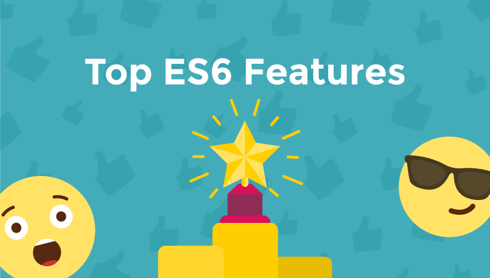
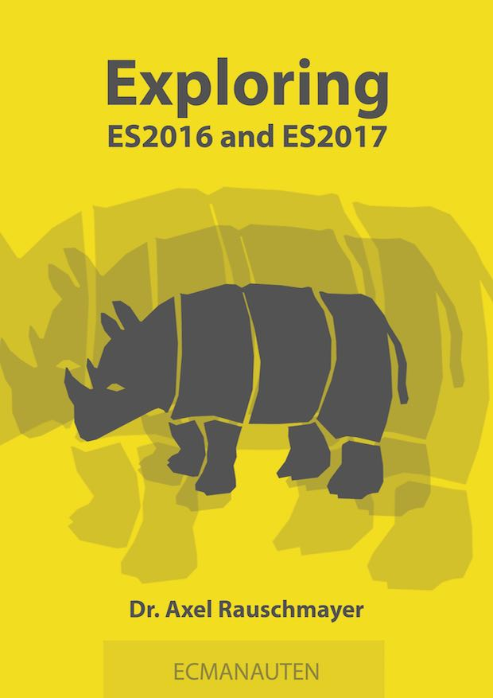

footer: © NodeProgram.com, Node.University and Azat Mardan 2017
slidenumbers: true

# ES7 and ES8 Features
## Outro

Azat Mardan @azat_co

---

## Tools

---

Use ES7 and ES8 with older browsers:

* Babel
* Tracuer TK

---

## Babel Presets

* `es2015-lose`
* `es2016`
* `es2017`
* `latest`
* `react`
* `stage-0`, 1, 2, 3

<https://babeljs.io/docs/plugins/#presets>

---

# ES8/ES2017 is still evolving

---

# Keep an eye on TC39 and proposals.

---

* TC39 process: <https://tc39.github.io/process-document>
* All proposals: <https://github.com/tc39/proposals/blob/master/README.md>
* Finished proposals: <https://github.com/tc39/proposals/blob/master/finished-proposals.md>
* Mozilla Developer Network (examples, what browser supports what feature in what version): <https://developer.mozilla.org/en-US/docs/Web/JavaScript>

---

# Further Study

---

For a refresher on Promises, arrow functions, let/const and other ES6/ES2015 features, enroll into Node.University's [ES6/ES2015 course](https://node.university/p/es6).

---

---

### Read for free online at <http://exploringjs.com/es2016-es2017/>

---

### ES.Next is a dynamic name that refers to whatever the next version is at time of writing.

---

### ES.Next features are more correctly called proposals, because by definition the specification has not been finalized yet

---

# ES.Next

* <https://github.com/esnext/esnext>
* <http://kangax.github.io/compat-table/esnext>
* <http://esnextnews.com>

---

## Now, go ahead and start *using* ES7 and ES& to others!

---

## The End 🏁